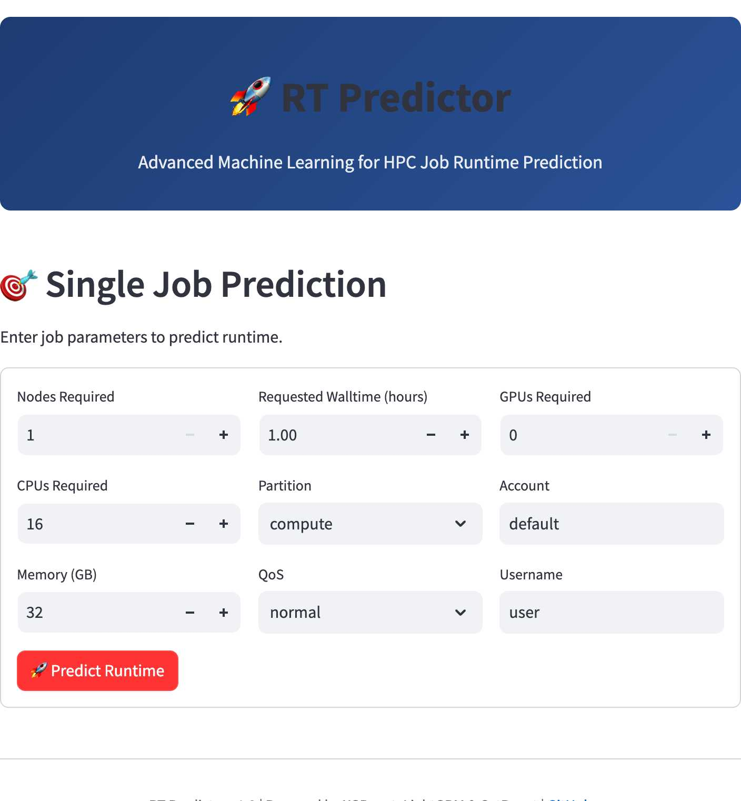
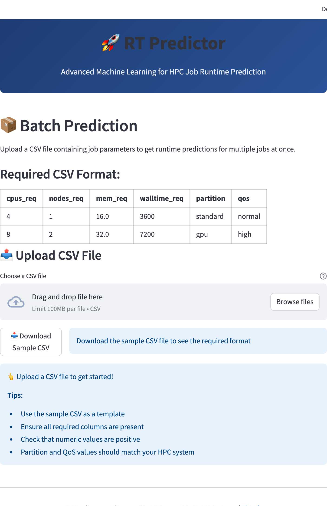
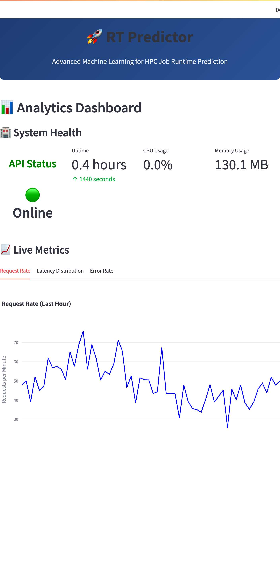
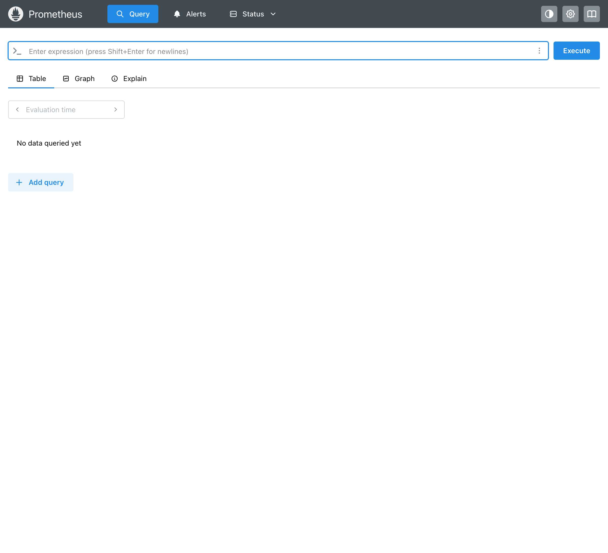
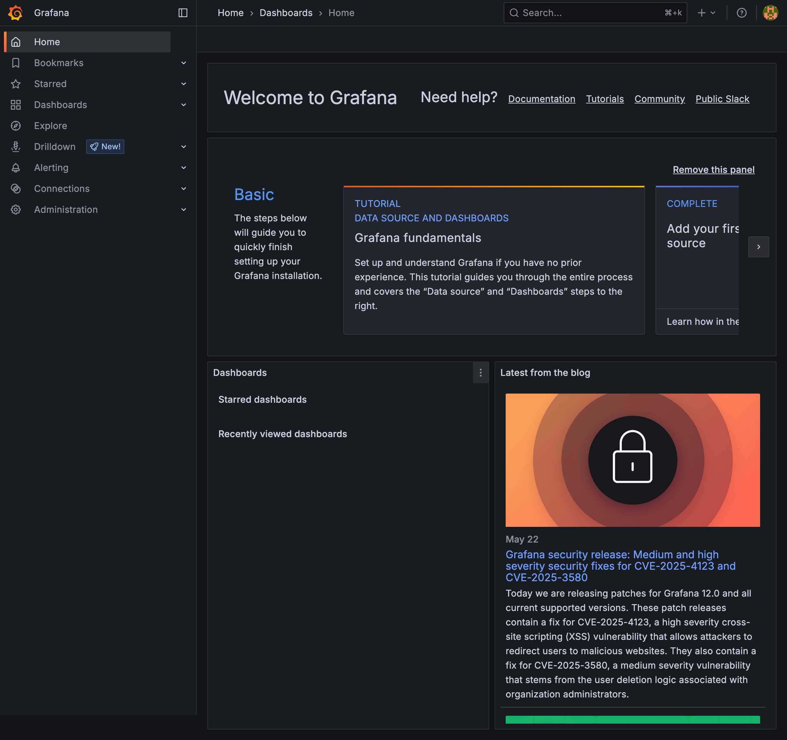

# HPC Run-Time Predictor Microservices

A production-ready microservices architecture for HPC job runtime prediction, featuring state-of-the-art machine learning models trained on the NREL Eagle dataset.

## 🚀 Quick Start

### Standard Setup
**Get everything running in one command:**

```bash
# Clone the repository
git clone <repository-url>
cd rt-predictor/microservices

# Run the automated setup
./quickstart.sh
```

### M2 Max Optimized Setup (Apple Silicon)
**For M2 Max with 64GB RAM:**

```bash
# Optimized setup for Apple Silicon
make fresh-start-m2max
```

This will automatically:
- ✅ Check prerequisites (Docker, Docker Compose)
- ✅ Pull training data (Git LFS)
- ✅ Build all Docker images
- ✅ Train ML models (~5-10 minutes)
- ✅ Start all services

## Architecture Overview

The system consists of three main microservices:

```
┌─────────────────┐     ┌─────────────────┐     ┌─────────────────┐
│                 │     │                 │     │                 │
│  Training       │────▶│  API Service    │◀────│  UI Service     │
│  Service        │     │  (gRPC)         │     │  (Streamlit)    │
│                 │     │                 │     │                 │
└─────────────────┘     └─────────────────┘     └─────────────────┘
         │                       │                       │
         │                       │                       │
         ▼                       ▼                       ▼
    ┌──────────┐            ┌──────────┐            ┌──────────┐
    │  Models  │            │ Metrics  │            │  Users   │
    │  Volume  │            │  (Prom)  │            │          │
    └──────────┘            └──────────┘            └──────────┘
```

## Services

### 1. RT Predictor Training Service
- Trains ensemble ML models (XGBoost, LightGBM, CatBoost)
- Processes 11M+ Eagle HPC job records
- Generates optimized feature engineering pipeline
- Outputs model artifacts to shared volume

### 2. RT Predictor API Service
- High-performance gRPC service
- Serves predictions with <10ms latency
- Handles single, batch, and streaming requests
- Exposes Prometheus metrics
- Health check endpoint
- Response caching and circuit breaker patterns

### 3. RT Predictor UI Service
- Modern Streamlit web interface
- Single and batch prediction capabilities
- Real-time analytics dashboard
- CSV upload for batch processing
- Model performance visualization

## 📋 Prerequisites

- Docker and Docker Compose
- 16GB+ RAM recommended (64GB for M2 Max optimization)
- 10GB+ disk space
- Git and Git LFS (for training data)

## 🛠️ Setup Instructions

### 1. Environment Setup

Set the `$DEV` environment variable to your development directory:

```bash
# Temporary (current session)
export DEV="/path/to/your/development/directory"

# Or permanent (add to ~/.bashrc or ~/.zshrc)
echo 'export DEV="/path/to/your/development/directory"' >> ~/.bashrc
source ~/.bashrc
```

### 2. Clone and Navigate

```bash
cd $DEV/rt-predictor/microservices
```

### 3. Prepare Training Data

```bash
# Option A: Use provided data (requires Git LFS)
git lfs pull  # Download data files
./scripts/copy_data.sh  # Copy to training directory

# Option B: Generate synthetic data
python rt-predictor-training/scripts/generate_synthetic_data.py
```

### 4. Train Models (First Time)

```bash
# Standard training
docker-compose --profile training up rt-predictor-training

# Or M2 Max optimized training (2-3x faster)
make train-m2max
```

### 5. Start All Services

```bash
# Start API, UI, and monitoring
docker-compose up -d

# Or with M2 Max optimization
make start-m2max
```

### 6. Access Services

- **UI**: http://localhost:8501
- **API**: localhost:50051 (gRPC)
- **Metrics**: http://localhost:8181/metrics
- **Prometheus**: http://localhost:9090
- **Grafana**: http://localhost:3000 (admin/admin)

## 📸 Screenshots

### RT Predictor UI

#### Single Prediction Page

*Make single job runtime predictions with an intuitive interface*

#### Batch Prediction Page

*Upload CSV files for bulk runtime predictions*

#### Analytics Dashboard

*Real-time system health monitoring and performance metrics*

<!-- ### Monitoring Stack

#### Prometheus

*Query and visualize metrics collected from all services*

#### Grafana

*Create custom dashboards for monitoring RT Predictor performance* -->

## 📊 Data Information

### Dataset Overview

The RT Predictor is trained on the NREL Eagle HPC System Dataset:
- **Size**: 11M+ job records
- **Features**: 18 columns including resource requests, runtimes, and metadata
- **Format**: Parquet files for efficient storage

### Data Schema

| Column | Description | Type |
|--------|-------------|------|
| job_id | Unique job identifier | int |
| processors_req | Number of processors requested | int |
| nodes_req | Number of nodes requested | int |
| mem_req | Memory requested in MB | float |
| wallclock_req | Requested walltime in seconds | float |
| partition | Compute partition | string |
| qos | Quality of Service level | string |
| run_time | Actual runtime in seconds | float |
| ... | Additional features | ... |

## 🚀 Performance & Optimization

### Standard Configuration
- **Training Time**: ~10-15 minutes on 11M records
- **Prediction Latency**: <10ms (p95)
- **Throughput**: 10K+ predictions/second
- **Model Accuracy**: MAE ~1.6 hours

### M2 Max Optimized (Apple Silicon)
- **Training Time**: ~5-8 minutes (2-3x faster)
- **CPU Usage**: 10 cores (83% utilization)
- **Memory**: Up to 48GB (75% of 64GB)
- **Improved accuracy**: Deeper trees and more iterations

#### M2 Max Key Optimizations:

1. **CPU Utilization**: Uses 10 cores, leaving 2 for system
2. **Memory Allocation**: 48GB for training, 8GB for API, 4GB for UI
3. **Model Parameters**: Increased tree depth and iterations
4. **Data Processing**: 5x larger chunk sizes (500k records)

## 🔧 Common Commands

```bash
# Fresh start (clean + setup + build + train + start)
make fresh-start

# Individual operations
make setup      # Initial setup
make build      # Build Docker images
make train      # Train models
make start      # Start services
make stop       # Stop services
make restart    # Restart services
make logs       # View logs
make status     # Check service status

# M2 Max optimized versions
make fresh-start-m2max
make train-m2max
make start-m2max

# Cleanup
make clean      # Stop and remove containers
make clean-all  # Deep clean including networks and volumes
```

## 🔍 Troubleshooting

### Common Issues

#### 1. Models not found
```bash
# Check shared volume
docker volume inspect microservices_shared-models

# Retrain models
make train
```

#### 2. Connection refused
```bash
# Check service health
docker-compose ps
docker-compose logs rt-predictor-api

# Restart services
make restart
```

#### 3. High latency
- Check resource limits
- Enable caching in API service
- Scale API replicas

#### 4. Git LFS issues
```bash
# Check LFS status
git lfs status

# Re-download LFS files
git lfs fetch --all
git lfs checkout
```

#### 5. Memory issues
```bash
# Use sample for development
python rt-predictor-training/src/train.py --sample-size 100000

# Or increase Docker memory in Docker Desktop settings
```

## 📈 Recent Updates

### Version 1.2.1 (2025-05-24)
- ✅ Fixed UI navigation issue (Streamlit auto-detection)
- ✅ All UI pages now working correctly
- ✅ Successful end-to-end predictions verified

### Version 1.2.0 (2025-05-24)
- ✅ M2 Max optimization support
- ✅ Batch prediction page implementation
- ✅ Analytics dashboard with live metrics
- ✅ Enhanced error handling and caching

### Version 1.1.0 (2025-05-23)
- ✅ Fixed all proto message mismatches
- ✅ Implemented health check endpoint
- ✅ Added circuit breaker and retry logic
- ✅ Complete UI implementation

See [CHANGELOG.md](CHANGELOG.md) for complete version history.

## 🏗️ Development

### Local Development

1. **Training Service**:
```bash
cd rt-predictor-training
python -m venv venv
source venv/bin/activate
pip install -r requirements.txt
python src/train.py
```

2. **API Service**:
```bash
cd rt-predictor-api
./scripts/generate_proto.sh
python src/service/server.py
```

3. **UI Service**:
```bash
cd rt-predictor-ui
streamlit run src/app.py
```

### Testing

```bash
# Run setup tests
./scripts/test_setup.sh

# Run service tests (when implemented)
docker-compose run rt-predictor-api pytest
docker-compose run rt-predictor-ui pytest
```

## 🚢 Production Deployment

### Kubernetes
```bash
# Apply manifests
kubectl apply -f k8s/
```

### Scaling
- **API**: Horizontal scaling with load balancer
- **UI**: Multiple replicas behind reverse proxy
- **Training**: Scheduled jobs with resource limits

## 🔒 Security

- Input validation on all endpoints
- gRPC with TLS support (configurable)
- API authentication ready
- No PII in training data
- Secure configuration management

## 📝 License

See LICENSE file in root directory.

## 🤝 Contributing

1. Follow microservice boundaries
2. Add tests for new features
3. Update documentation
4. Use conventional commits

## 📚 Additional Resources

- [Training Service README](rt-predictor-training/README.md)
- [API Service README](rt-predictor-api/README.md)
- [UI Service README](rt-predictor-ui/README.md)
- [NREL's HPC dataset of 11M+ jobs](https://github.com/NREL/eagle-jobs/)
